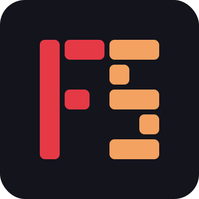
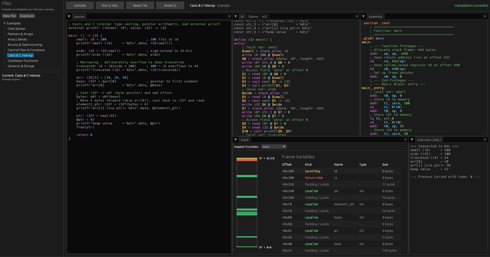

<div align="center">



# Full‑Stack

### Interactive compiler pipeline, from source to RISC-V assembly

[](https://lpc4.github.io/Full-Stack/)
[](https://github.com/LPC4/Full-Stack/actions/workflows/pages.yml)[](https://www.rust-lang.org)
[](LICENSE)
[](https://riscv.org)

</div>

---

## Overview

Full‑Stack is a **self‑contained compiler pipeline** for a custom systems language.  
Every stage, lexing, parsing, semantic analysis, IR generation, register allocation, and RISC‑V code emission, runs directly in the browser (or natively) and is **visualised in real time**.

The pipeline produces **RV64IMAFD assembly** that can be assembled, linked, and executed inside a RISC‑V emulator (QEMU).  
All components are written in Rust and exposed through an egui interface.

---

## Pipeline at a glance

| Stage | View | What you see                                                              |
|-------|------|---------------------------------------------------------------------------|
| **Source** | `Source` | Syntax‑highlighted editor for HLL programs                                |
| **Tokens** | `Tokens` | Raw token stream from the lexer                                           |
| **AST** | `AST` | Abstract syntax tree (pretty‑printed)                                     |
| **IR** | `IR` | Typed, SSA‑form intermediate representation                               |
| **Assembly** | `Assembly` | Generated RISC‑V assembly (RV64IMAFD)                                     |
| **Stack** | `Stack` | Stack frame layout, saved registers, locals per function                  |
| **Execution** | `Execution` | Stdout and exit code from running the binary in QEMU (only works locally) |

All panels are resizable and can be rearranged, the layout persists across sessions.

---

## Live version

No install required, the compiler runs client‑side via WebAssembly.

<p align="center">
  <a href="https://lpc4.github.io/Full-Stack/">
    
  </a>
</p>

**[Open the live app →](https://lpc4.github.io/Full-Stack/)**

---

## The language

The project includes a small systems language called **HLL** (High‑Level Language).  
It was designed to make memory operations completely explicit and predictable.

- **`T*` is a pointer, never implicitly dereferenced.**  
  Use `@ptr` to read/write, `&var` to take an address.
- **Structs, arrays, generics, and inline aggregates** (multiple returns via structs).
- **`defer`** for deterministic cleanup.
- **Compile‑time evaluation**, pure functions, loops, recursion all resolved at build time.
- **Manual memory management** with `new`/`free`.
- **C interop** via `external` declarations.

A small example:

```hll
type Point = { x: f32, y: f32 }

calc_offset: (p: Point*, shift: f32) -> f32 {
    @p.x = @p.x + shift
    @p.y = @p.y + shift
    return @p.x * @p.y
}

main: () -> i32 {
    p: Point* = new(Point)
    @p = { .x = 3.0, .y = 4.0 }
    result: f32 = calc_offset(p, 1.0)
    free(p)
    return 0
}
```

For the full specification, see the [language reference](src/1_high_level_language/_LANG_SPECIFICATIONS.md).

---

## Documentation

- [Language specification](src/1_high_level_language/_LANG_SPECIFICATIONS.md)
- [IR design](src/2_intermediate_language/_IR_SPECIFICATIONS.md)
- [RISC‑V backend](src/3_assembly_language/_RISC_SPECIFICATIONS.md)
- [Source tree overview](src/)

---

## Testing

```bash
cargo test
cargo test -- --nocapture   # full output
```

Golden‑file tests compare generated IR and assembly against expected snapshots.

---

## Contributing

Pull requests are welcome. For larger changes, please open an issue first to discuss the approach.

1. Fork the repository
2. Create a feature branch (`git checkout -b feature/your-change`)
3. Commit your changes with clear messages
4. Push and open a PR

---

## License

Dual‑licensed under MIT and Apache 2.0, see [LICENSE-MIT](LICENSE-MIT) and [LICENSE-APACHE](LICENSE-APACHE) for details.

---

<div align="center">
  <sub>Built with Rust and <a href="https://github.com/emilk/egui">egui</a></sub>
</div>